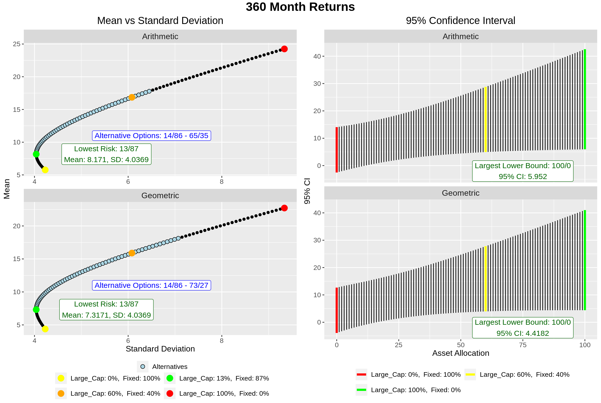

```{r setup, include=FALSE}
knitr::opts_chunk$set(echo = FALSE)
```

\newpage

```{=tex}
\begingroup
\centering
```
\Large \textbf{Executive Summary}

```{=tex}
\par
\endgroup
\begin{singlespace}
\end{singlespace}
```
|   The purpose of this report is to address the important concerns and questions that have been brought up due to the 16.2 percent investment loss of the MERS fund experienced in calendar year 2022. We will be reviewing the historical data over the past century, the current MERS investment approach alongside its advantages and disadvantages, and alternative approaches that might prove more advantageous when considering a 30 year pension fund and the premise of a one-time top-up.

```{=tex}
\begin{onehalfspacing}
\end{onehalfspacing}
```
```{=tex}
\begingroup
\centering
```
\large Concerns

```{=tex}
\par
\endgroup
```
|   The traditional investment approach the firm has used for the MERS fund has been a 60/40 investment approach where 60% of the funds are invested in US large cap equities and 40% of the funds are invested in a blended fixed income fund. The blended fixed income fund is composed of an asset mix of 65% intermediate-term government bonds and 35% long-term corporate bonds. The MERS fund experienced an investment return of -16.2% in calendar year 2022. This recent loss leads to a few questions about the MERS fund. Firstly, will the recent rise in long-term bond yields likely be a temporary effect that could go away? Next, are there alternative investment approaches that could prove to be more beneficial for the pension fund? And finally, how will a one-time top-up of \$175 million effect the outcome and will it necessitate an alternative investment approach?

```{=tex}
\begin{onehalfspacing}
\end{onehalfspacing}
```
```{=tex}
\begingroup
\centering
```
\large Answers and Solutions

```{=tex}
\par
\endgroup
```
|   The rise in long-term bond yields has been found to be a temporary effect that will last for a few years and will likely end sometime in 2024. The reasons for the occurrence of this temporary effect will be explored within the following report.

|   Furthermore, the 2022 experience is unlikely to repeat itself once long-term bond yields return to normal. Using the AIRG Economic Scenario Generator (ESG), it has been calculated that there is less than a 1.32% chance of another year experiencing a loss of more than 16% on total returns for the MERS fund. Further explanation will be provided in the main report.

|   Concerning the current strategy of the MERS fund, it has been concluded that it is a suboptimal investment approach for the purpose of a 30 pension fund. A more detailed explanation for this along with the merits of the current investment approach will be discussed in more detail within the main report.

|   Finally, a one-time top-up will increase the probability of acquiring sufficient funds for the pension plan, but will result in a large surplus that will need to be refunded to the city. The reasons for this surplus will be portrayed through the examination of what happens when the beginning funds are increased or decreased.

\newpage

```{=tex}
\begingroup
\centering
```
\large \textbf{The 60/40 Portfolio}

```{=tex}
\par
\endgroup
```
|   Before we get into the reason for the severe loss during the 2022 calendar year, we will first take a look at the 60/40 portfolio as an investment approach. This portfolio invests 60% in stocks and 40% in bonds.

|   While stocks have a high return potential and high volatility, bonds are more stable with a low volatility alongside low returns. As stocks have historically outperform bonds, investing in bonds two-thirds of the amount invested into stocks allows for a steady income while reaping the benefits of the higher returns for stocks. Thus, the 60/40 portfolio provides reasonable returns while reducing volatility. Additionally, this steady income should theoretically mitigate stock return losses in the event of a market downturn.

|   The 60/40 portfolio does have some disadvantages. In the long-term, equities tend to have better returns than bond, which means that you would be sacrificing some returns when the stock market is up. However, the most glaring disadvantage is interest rate risk. When interest rates rise, bond yields decrease. This means that in the event of a significant market downturn, the 40% invested in bonds will not be enough to mitigate the losses accrued from the 60% invested in stocks. It therefore increases the amount of risk in your portfolio because it reduces the amount of loss in returns that bonds can mitigate. The graphic below shows some of the significant historical 12-month returns for the 60/40 portfolio.

```{=tex}
\begin{singlespacing}

\end{singlespacing}
```
 
\begin{singlespacing}
\end{singlespacing}
\
|   The value corresponding to each month is the 12-month total returns starting at said month. These particular months are when the 12 month-total returns are within the 5 percentile out of all 12 month periods since 1926. The colors for each of the values corresponds to the probability of another 12-month period having an equal or greater loss on returns. 

|   We can see that the 16.2% loss on returns is shown for the month of January of 2022. Before 2022, the probability of a 16% loss on returns was 2.569%. However, if the only data being looked at is complete calendar years, then that probability would decrease to 1.77%. Using the AIRG Economic Scenario Generator (ESG), 1000 paths were simulated for the annual total returns each year for a total of 30 years. By those 30000 observations, the probability of incurring a net loss on returns of 16% or greater is 1.312%. I am inclined to believe this probability because it was taken from 30000 observations instead of the 96 historical observations that were used to calculate a 1.77% probability. 

| Ultimately, there was a clear reason for why the MERS fund did so poorly during 2022. During 2022, bonds suffered their worst year on record. This is vitally important to note because bonds are considered to be a defensive asset as they are less volatile than stocks. For this reason, investors include bonds in their portfolio as a way to help reduce volatility and overall portfolio risk in the event that there is a significant market downturn, something that did occur in 2022. Unexpectedly, the US government increased the interest rate by a cumulative 4.25%, the most since 1980. Consequentially, when interest rates increase, the value of bonds decreases. Additionally, inflation impacts the real rate of return of fixed-income investments. This decrease in real return makes the bond less attractive to investors, leading to a decrease in bond prices. When inflation is larger than the interest rate, investors tend to reinvest their fixed-income investments in order to minimize their total return losses, leading to a decrease in the real value of the fixed-income investments. Because these events took place concurrently alongside a significant market downturn, every single asset allocation strategy resulted in a minimum total loss of 13.3%.
\begin{singlespacing}
\end{singlespacing}

```{=tex}
\begingroup
\centering
```
\large \textbf{Asset Allocation Optimization}

```{=tex}
\par
\endgroup
```
|   In order to determine the best asset allocation, it is necessary to compare their performances over different periods of time. As previously stated, stocks perform better in the long-term while bonds perform better in the short-term. Knowing this, it was expected that the percent invested in large cap equities would go from close to 0% in the shortest period of time to 100% in the longest period of time. To appropriately decide which asset allocation were the best for each period of time, a series of measurements were calculated for each allocation. This included, the mean, standard deviation, 95% confidence interval, Sharpe ratio, and the risk-reward ratio. While the standard deviation will determine which asset allocation has the least risk, the 95% confidence interval will determine which allocation has the greatest total return at the 2.5 percentile of observations. 

|   Additionally, both the geometric and arithmetic means will be used for calculations. While both arithmetic and geometric means are close to each other, geometric means are considered to be more conservative estimates because they are less effected by extreme values. While that may be useful, we are currently investigating after the appearance of an extreme value, -16.2%. Therefore, both will be compared to one another. Shown below is the mathematical difference between both means.  
$$
\begin{aligned}
x_i = \text{monthly total return} & \ \ \ \ \ n =\ \text{amount of months within the period}\\
Arithmetic\ Mean = \frac{1}{n}\sum_{i=1}^nx_i & \ \ \ \
Geometric \ Mean = (\prod_{i=1}^n(1+x_i))^{1/n}\  -\ 1
\end{aligned}
$$

|   Throughout this section, the figures will be formatted with graphs using an arithmetic mean on top and calculations using a geometric mean on the bottom. The graphs below depict the mean versus the standard deviation of monthly returns on the left side and the 95% confidence interval for monthly returns on the right side. The colors are arranged from best to worst and include green, orange, yellow, and red, with red as the worst and green as the best.  

\begin{singlespacing}
\end{singlespacing}

<center></center>

\begin{doublespacing}
\end{doublespacing}

|   For the graphs on the left, the best asset allocation is indicated by the lowest standard deviation which in this case means the lowest risk and volatility. For the graphs on the right, the best asset allocation is indicated by the highest lower bound of the confidence interval. The lower bound of a confidence interval is the value at which any value lower than it has only a 2.5% probability of occurring. The graphs show that the best asset allocation is either the 5/95 portfolio or the 4/96 portfolio.

|   The blue points indicate alternative asset allocations for those who are less risk adverse and willing to implement a strategy using an asset allocation with a higher risk than the risk of the asset allocation with the lowest risk. For monthly returns, these alternative asset allocations range from the 14/86 portfolio to the 21/79 portfolio. Shown below are the calculations used to determine the alternatives using the 4/96 portfolio as the benchmark:
\begin{spacing}{0.1}
\end{spacing}
$$
\begin{aligned}
x_i = \text{Mean of Asset Allocation i/(100-i)}; & \ \ \ \ y_i = \text{Standard Deviation of Asset Allocation i/(100-i)}\\
\hat{x} = \text{Mean of Asset Allocation 4/96}; &\ \ \ \  \hat{y} = \text{Standard Deviation of Asset Allocation 4/96}\\
(x_i - \hat{x})/\hat{x}\ &\ge\ 1.96 * (y_i - \hat{y})/\hat{y}
\end{aligned}
$$

The figure below graphs the measures of the risk-reward ratio and the Sharpe ratio.
\


|   The Sharpe ratio is a measure of the performance of an investment compared to a risk-free asset, which in this case, is the historic yield of the Ibbotson® SBBI® US (30-Day) Treasury Bills. Meanwhile, the risk reward ratio measures the expected gains from an investment against the risk of loss. The reason why there are two columns for the Sharpe ratio is because there were two methods used to determine the risk-free rate of return. The calculation used the for both methods as well as the risk-reward ratio are shown below:

\begin{spacing}{0.5}
\end{spacing}

$$
\begin{aligned}
x_i = \text{monthly returns};  & \ \ \ \ \ \ \ r_i = \text{monthly risk-free rate of return}\\
risk-reward\ ratio\ = &\frac{\text{mean}(x_i)}{\text{standard deviation}(x_i)}\\
sharpe\ ratio\ = &\frac{\text{mean}(x_i-r_i)}{\text{standard deviation}(x_i)}\\
\text{Where the risk-free } & \text{rate of return is calculated in two ways:}\\
r_1\ =\ &\frac{1+\text{Government Bond Rate}}{1+\text{Inflation Rate}}\ -\ 1\\
r_2\ =\ &\text{Government Bond Rate - Inflation Rate}
\end{aligned}
$$

\begin{spacing}{2}
\end{spacing}

|   Observing the graphs above, the greatest rates for monthly returns are all around 0.3 which makes sense considering that the average monthly return for each allocation, as seen in the mean versus standard deviation graphs, are all less than 0.01. Unlike those graphs, these graphs show that the best asset allocation is the 12/88 portfolio. This is more in line with the alternative asset allocations that were found.

|   As we have discussed, bonds are more profitable in the short-term while stocks are more profitable in the long term. For this reason, it is expected that the 95% interval, sharpe ratios, and the risk-reward ratio for longer periods of time will show the optimal asset allocation shifting in a consistent direction. This means that the expected asset allocations for monthly returns and 30-year returns should be almost the exact opposite of one another. On the next few pages, the figures will show the same graphs for 12-month returns, 120-month returns, 240-month returns, and 360 month returns. Specifically, the observations used in these figures are calculated by using compounded returns of the amount of months in the period. This means that it includes observations that are compounded starting at every month of the year, not just the first month of they year.
```{=tex}
\begingroup
\centering
```


\begin{spacing}{1.5}
\end{spacing}
\
 


\begin{spacing}{1.5}
\end{spacing}
\
 


\begin{spacing}{1.5}
\end{spacing}
\
 



\begin{spacing}{1.5}
\end{spacing}
\


```{=tex}
\par
\endgroup
```
|   It is easy to notice that the time periods where the greatest lower bound of the 95% confidence interval increases the most are between the 1 year and 10 year periods and between the 20 year and 30 year periods. Contrary to what was expected, the asset allocation with the greatest lower bound for the 20-year period invests less assets in stocks than the asset allocation with the greatest lower bound for the 10 year period. It shows that historically, stocks were less profitable in the 20 year period compared to in the 10 year period, the opposite of the initial assumption that stocks are more profitable in the long run. Based on all of the information obtained from the graphs, it looks like the measures of the risk-reward ratio and Sharpe ratios are the most accurate predictors of the best asset allocation. This is because both ratios allow investors to determine the amount of reward needed per unit of risk.

\begin{singlespacing}
\end{singlespacing}

```{=tex}
\begingroup
\centering
```
\large \textbf{30 Year MERS Pension Fund}

```{=tex}
\par
\endgroup
```

|   Based on the figures for the 360-month asset allocation, it would appear that the most optimal asset allocation would be somewhere around the 55/45 portfolio or the 57/43 portfolio. To test this, we will use the AIRG Economic Scenario Generator (ESG) alongside the 30-year pension payments, and an insolvency rate of 7%. For each asset allocation, we will start with an initial fund of $525 million and see how many paths out of the 1000 are able to acquire the necessary funds for the 30 years of payments. The results can be seen in the figure below.


|   The top graph compares the mean and standard deviation of the balance of the pension fund at the end of 30 years. The middle graph shows the probability that each asset allocation ended up with a positive balance at the end of the 30 years. From this graph, we can see that the 50/50 portfolio is the asset allocation whose probability of making all 30 years of payments is the highest. Finally, the bottom graph shows the average deficit and surplus for each asset allocation at the end of 30 years. Looking at this graph, we can see that the difference between the average surplus and deficit increases with the percentage invested in large cap equities. Additionally, the least sufficient asset allocations appear to have the smallest differences between their average deficits and surpluses. While any surplus is owned by the city, a large surplus indicates that the city overcontributed to the pension fund. With that in mind, it would appear that the smallest average surplus would be beneficial. The issue is that the asset allocation with the smallest surplus also has the lowest probability of making all 30 years of payments in full. The question that will need to be considered with the city is how much of a surplus is it willing to have at the end of the 30 years. That would involve balancing the amount of surplus with the probability of there being a surplus and would ultimately be decided on how much they value the pension payments to be paid in full compared to how much they value not overcontributing to the pension fund.
\begin{singlespacing}
\end{singlespacing}

```{=tex}
\begingroup
\centering
```
\large \textbf{One-Time \$175 Million Top-Up}

```{=tex}
\par
\endgroup
```

|   Finally, we will address the question of how much a one-time top-up of $175 million dollars to the pension fund would improve the outlook. Clearly, adding more money to the initial pension fund will increase the chances of being able to make all payments in full. To demonstrate this, we will observe the increase in the probability of having a surplus in the figure below.


|   As you can see, the top-up increases the the probability of each asset allocation to end with a surplus after 30 years. At the same time, the average surplus increases while the average excess decreases. At its most optimal asset allocation, 30/70, there is a 91% chance of making all payments in full and ending with a surplus. This is a 15% increase which can be attributed to the top-up of $175 million. The trend appears to be that increasing the amount of funds for the pension will increase the chances of making all payments in full as well as increase the amount of surplus at the end of 30 years. At the end of the day, the question that still needs to be addressed is how much the city values the pension being paid in full compared to the disadvantage of overcontributing to the pension fund. 